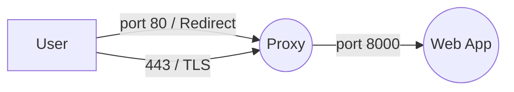

# Docker compose

A simple Docker Compose example using an nginx proxy and express.js web app

## Image Build Args

|  Image| Argument |Description | Default|
|----------------|-------|-------------|-----------|
|proxy |hname|host name to use for the self signed cert and nginx server name|www.example.com|
|proxy |url_token| Used to set the path to our content |secret|
|proxy |auth_user | The name of the user to use in http basic auth| user|
|proxy |auth_pass | The password to use for the above user in http basic auth|password|
|proxy |web_app_port| The port to connect to the backend web app on|8000|
|web|web_app_port| The prot to run the web app on|8000|
|web|url_token| Used to set the path to our contnet|secret|

## File and Directory Overview

|  File / Directory               |Description                                   |
|----------------|-------------------------------|
|docker-compose.yml |The configuration for docker compose|
|proxy          |Directory containing the files for creating the proxy container            |
|web          |Directory containing the files for creagting the web container|
| proxy/Dockerfile| The Docker file for creating the proxy image|
| proxy/nginx.comf| The nginx configuration file for the proxy image|
|web/Dockerfile| The Docker file for creating the web image|
|web/server.js| The web application code|
|web/package.js| The node js packaging information| 

## Build Instructions
`cd proxy && docker build . --rm --tag proxy`
`cd web && docker build . --rm --tag web`
then to run, from the root directory of the repo
`docker-compose up -d`
## Flow Diagram

